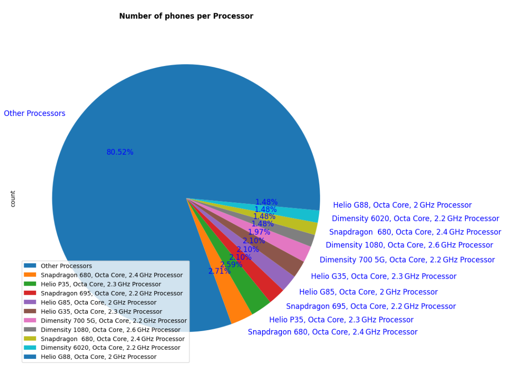

<<<<<<< HEAD
# smartphones-data-analysis
=======
# Smartphone Data Analysis Project

## Overview
This project analyzes a dataset of smartphones, focusing on their specifications, prices, and expert ratings. The analysis includes data cleaning, exploration, and visualization to uncover insights about the relationship between smartphone features and their ratings/price.

- **Dataset Source:** [Kaggle - Smartphone Uncleaned Dataset](https://www.kaggle.com/datasets/mousamkumar123/smartphone-uncleaned-dataset/)
- **Records:** 1020 (after cleaning: ~811)
- **Attributes:** Model Name, Price, Specification Score, Processor, RAM, Storage, Battery, Display Features, Camera

## Main Steps
1. **Data Loading & Initial Exploration**
   - Load the dataset using pandas
   - Display basic info and statistics
2. **Data Cleaning**
   - Remove unnecessary columns (e.g., index)
   - Rename columns for consistency
   - Handle missing and duplicate values
   - Convert price/specification score to numeric
   - Split storage into RAM and Storage columns
   - Reorder columns and sort by specification score
3. **Exploratory Data Analysis (EDA)**
   - Summary statistics for price and specification score
   - Compare before/after cleaning
   - Aggregate functions (mean, median, etc.)
4. **Visualization**
   - Correlation heatmap
   - Price vs. specification score
   - Processor distribution (pie chart)
   - RAM vs. specification score and price

## Example Visualization



## How to Run
1. Install requirements:
   ```bash
   pip install -r requirements.txt
   ```
2. Download the dataset from Kaggle and place it as `SmartphoneData.csv` in the project directory.
3. Open and run the notebook `Smartphone Data Analysis.ipynb` in Jupyter or VS Code.

## Requirements
See `requirements.txt` for the full list. Main packages:
- pandas
- numpy
- matplotlib
- seaborn

## Project Structure
```
Smartphone Data Analysis.ipynb
requirements.txt
SmartphoneData.csv
README.md
Mobile Prices/
```

## Author
- Mostafa Eslam Elsayed
- Date: May 2024
>>>>>>> e1dff5a (Initial commit: Smartphone Data Analysis project)
